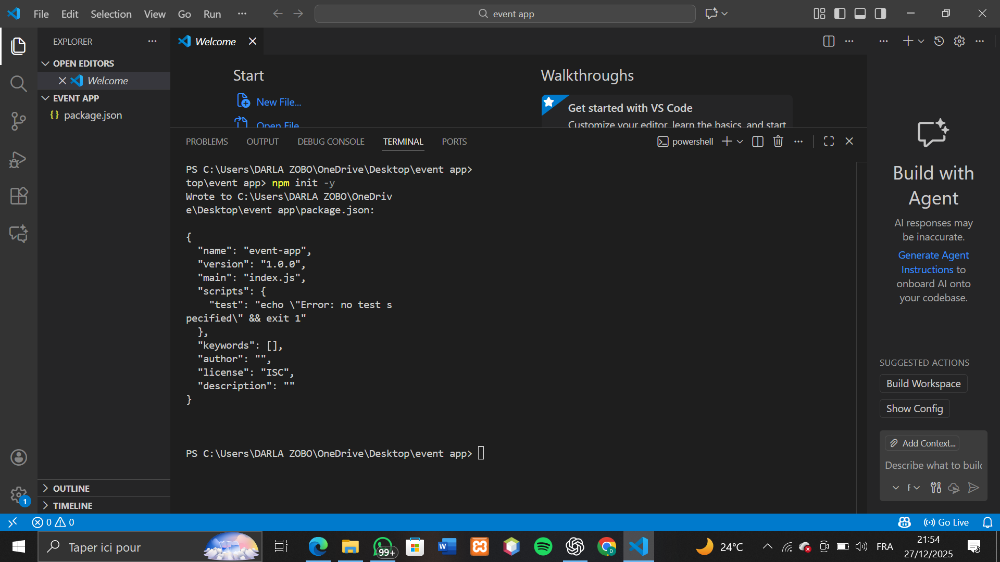
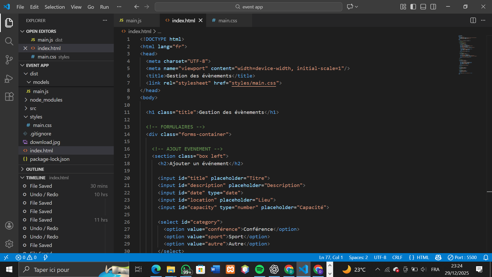
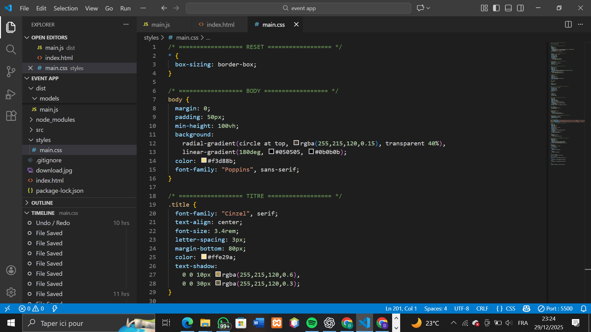
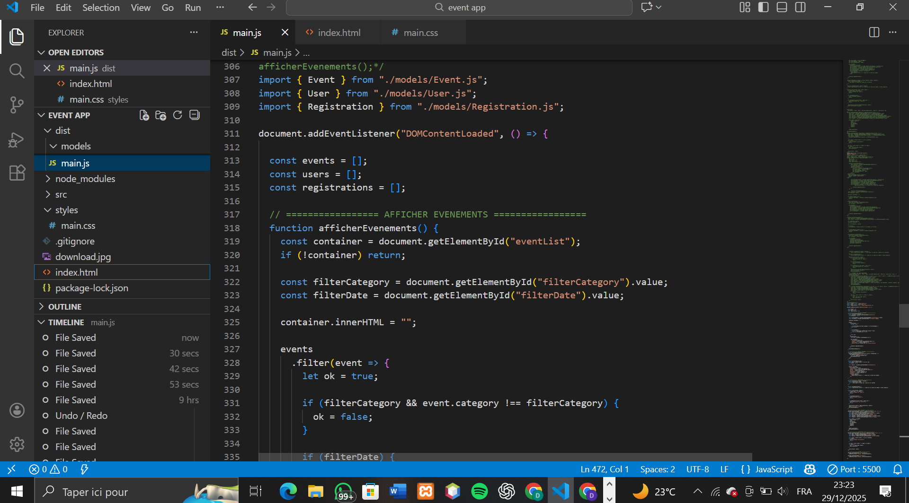
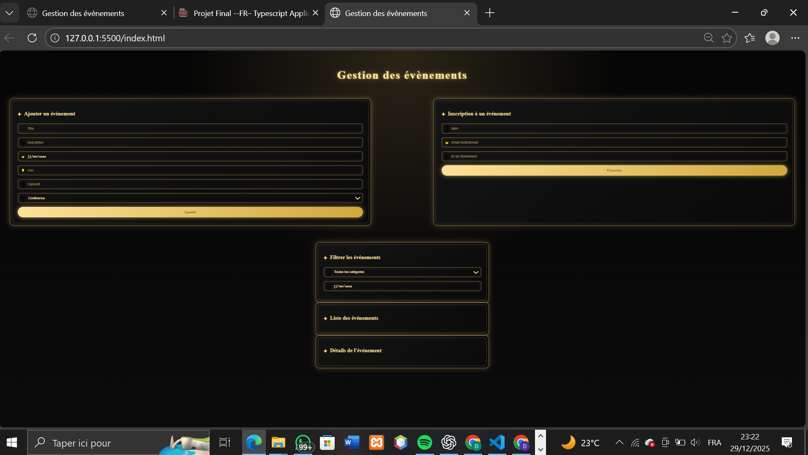

# Projet-final-typeScript
# Gestion des Événements – Mini TP TypeScript

## Description
Cette application web permet la gestion d’événements et des inscriptions des utilisateurs.
Toutes les données sont stockées en mémoire à l’aide de tableaux JavaScript et manipulées via des classes TypeScript.

## Fonctionnalités
- Création d’un événement (titre, description, date, lieu, catégorie, capacité)
- Affichage de la liste des événements
- Filtrage des événements par catégorie et par date
- Affichage des détails d’un événement
- Inscription d’un utilisateur à un événement
- Blocage de l’inscription si :
  - l’événement est complet
  - l’événement est déjà passé
  - l’utilisateur est déjà inscrit

## Technologies utilisées
- HTML
- CSS
- TypeScript
- JavaScript

## Arborescencee 
event-app/
│── index.html              # Page principale
│── styles/
│   └── main.css            # Styles CSS
│── src/
│   ├── models/
│   │   ├── Event.ts        # Classe Event
│   │   ├── User.ts         # Classe User
│   │   └── Registration.ts # Classe Registration
│   └── main.ts             # Logique principale
│── scripts/
│   └── start.js            # Script de lancement automatique
│── dist/                    # Fichiers JS compilés (généré)
│── package.json
│── tsconfig.json
│── .gitignore
│── README.md

## Installation & Lancement
### Étapes
## Cloner le dépôt
git clone https://github.com/isabelledanabiakan-code/Projet-final-typeScript.git
cd event-app

## Installer les dépendances
npm install

## Compile le TypeScript en JavaScript 
npx tsc

## Lancer l'application 
Ouvre le fichier index.html dans un navigateur

## Mode d'utilisation

### Comment créer un événement ?
-   L’utilisateur remplit les champs du formulaire situé dans la section « Ajouter un événement » :
-   Titre, Date, Lieu, Capacité, Description, Catégorie.
-   Ensuite, il clique sur le bouton « Ajouter ».
-   L’événement est alors automatiquement ajouté à la liste des événements visibles plus bas.

### Comment filtrer ou rechercher ?
 L’utilisateur peut :
  - Saisir la date de l’évènement et  choisir une catégorie dans un champ de filtre.
  - La liste affichera uniquement les événements correspondants.

   « Pour l’instant, l’application n’inclut pas de fonction de recherche. »
### Comment s’inscrire à un événement ?

- Dans la section « Inscription à un événement », l’utilisateur saisit :
- Son nom, email, et l’ID de l’événement auquel il souhaite s’inscrire (visible dans la liste).
- Il clique ensuite sur le bouton « S’inscrire ».
- Si l’inscription est validée, l’événement met à jour sa capacité restante.

### Que se passe-t-il si l’événement est plein ?

- Si le nombre d’inscrits atteint la capacité maximale de l’événement :
  - L’inscription est refusée.
 - Un message d’alerte s’affiche pour informer que l’événement est complet.

## capture d'écran 
### crée le fichier package.json

### Installe TypeScript

### code html 

### code css 

### code javascript

### interface principale 

### Page détail d’un événement

### Formulaire d’inscription

### Page accueil (liste d'événements)

## Auteur
# - Noms :
DANABIAKAN ZOBO 
# - matricule : 

# - email : 
  institutionnel : isabelle.danabiakan@saintjeaningenieur.org
   personnel : danabiakanisabelledarla@gmail.com

